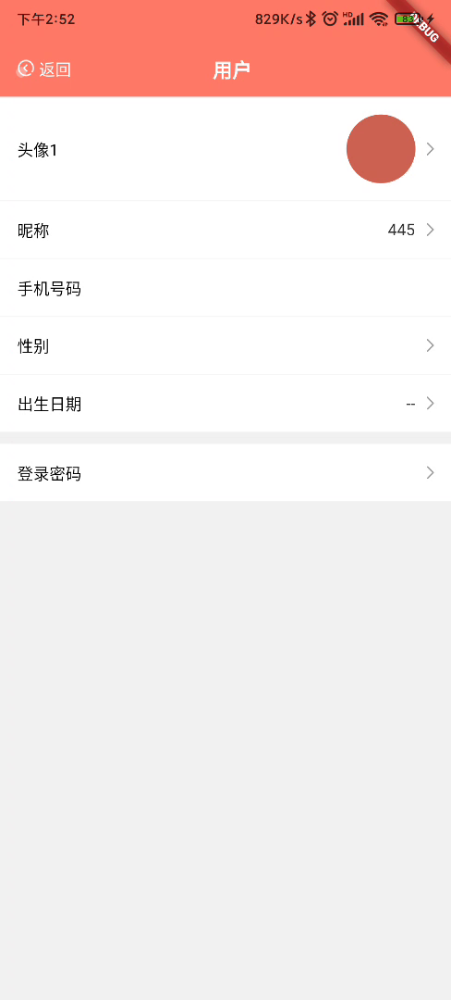
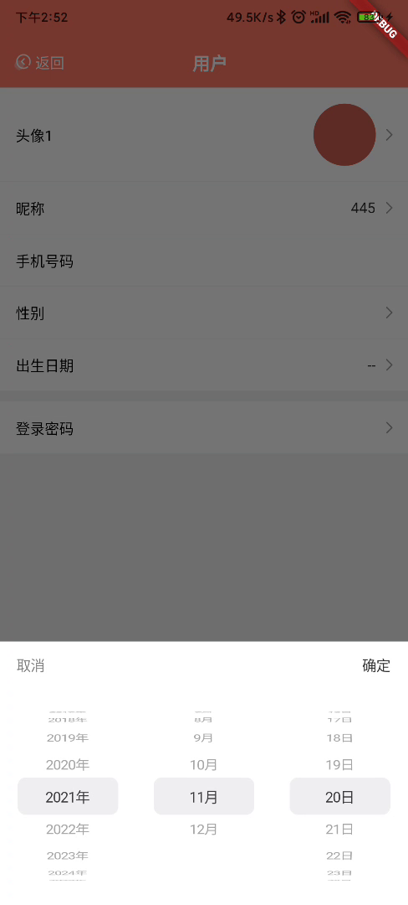

# flutter_user_info

A new flutter module project.

## Getting Started

For help getting started with Flutter, view our online
[documentation](https://flutter.dev/).

For instructions integrating Flutter modules to your existing applications,
see the [add-to-app documentation](https://flutter.dev/docs/development/add-to-app).

